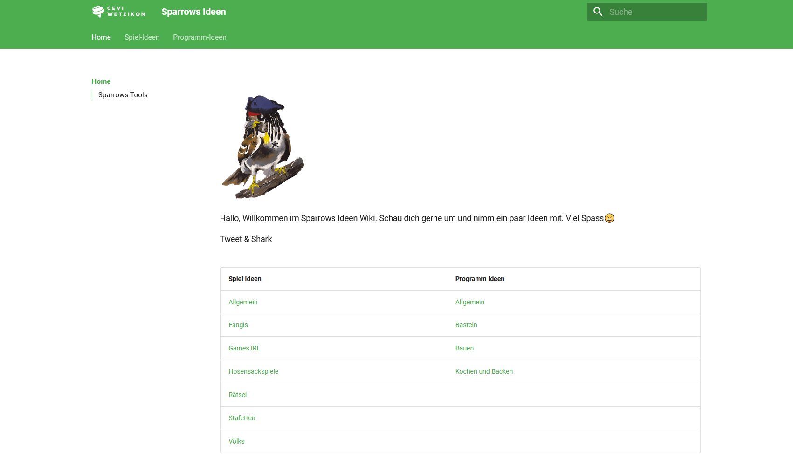

# Sparrows-Ideen

Sparrows Ideen ist die die Ideensammlung der Stufe Sparrows - Cevi Wetzikon. Sie basiert auf [Material for MkDocs](https://squidfunk.github.io/mkdocs-material/) und der Inhalt auf Markdown Files die mit [Obsidian](https://obsidian.md/) bearbeitet werden.



Webseite unter: https://sparrows-ideen.linoo.ch/

## Projekt Lokal öffnen
Das Projekt kann lokal mit Venv geöffnet werden.

**Voraussetzungen**
- Python3 --> Kann hier installiert werden [Python Downloads](https://www.python.org/downloads/windows/)

1. GitHub Projekt [Surmatik/Sparrows-Ideen](https://github.com/surmatik/Sparrows-Ideen.git)klonen via Github Desktop oder
   ```sh
   https://github.com/surmatik/Sparrows-Ideen.git
   ```
2. Aktivieren der virtuellen Umgebung
   ```Powershell
   python -m venv venv
   venv\Scripts\Activate.ps1
   ```
3. Live Preview unter http://localhost:8080 starten
   ```sh
   mkdocs serve
   ```


## Mkdocs Ordnerstruktur
Konfiguriert die die Webseite über `mkdocs.yml`. Die Navigation wir darin unter `nav` konfiguriert.
```yaml
nav:
  - index.md
  - Spiel-Ideen:
    - Unterkategorien ...
  - Programm-Ideen:
    - Unterkategorien ...
```


## Deployment
Bei einem Push in den `Main` Branch wird die seite automatisch via dem [Github Automation ci.yml](https://github.com/surmatik/Sparrows-Ideen/blob/main/.github/workflows/ci.yml) auf Github Pages mit der CNAME parrows-ideen.linoo.ch deployed.