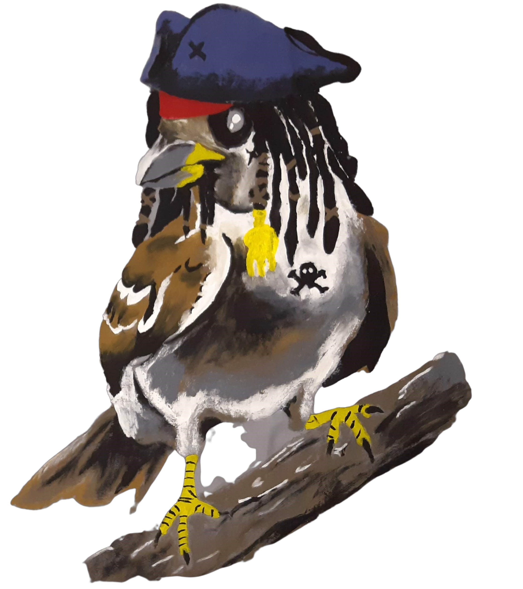

#

Hallo, Willkommen im Sparrows Ideen Wiki. Schau dich gerne um und nimm ein paar Ideen mit. Viel Spass😄

Tweet & Shark
 
 

| Spiel Ideen       | Programm Ideen    | 
|:----------------- |:----------------- |
| [Allgemein](Spiel-Ideen/Allgemein/) | [Allgemein](Programm-Ideen/Allgemein/) |
| [Fangis](Spiel-Ideen/Fangis/) | [Basteln](Programm-Ideen/Basteln/) |
| [Games IRL](Spiel-Ideen/Games-IRL/) | [Bauen](Programm-Ideen/Bauen/) |
| [Hosensackspiele](Spiel-Ideen/Hosensackspiele/) | [Kochen und Backen](Programm-Ideen/Kochen-und-Backen/) |
| [Rätsel](Spiel-Ideen/Raetsel/) | [Lernen](Programm-Ideen/Lernen/)
| [Stafetten](Spiel-Ideen/Stafetten/) |
| [Völks](Spiel-Ideen/Voelks/) |

